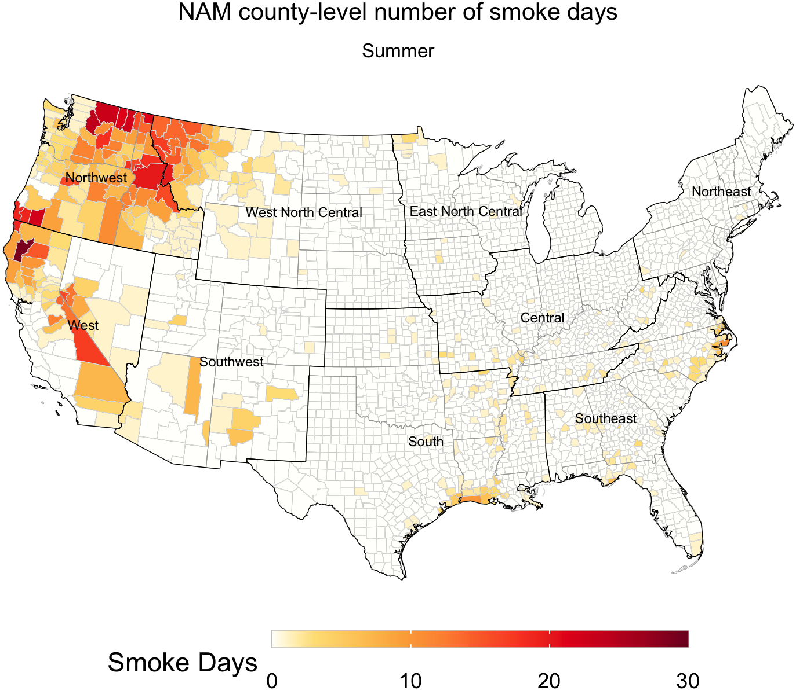

# BlueSky Wlidfire Smoke Data Analysis
Collection of code used in the paper Public Health Applications of Historical Smoke Forecasts: An Evaluation of Archived BlueSky data for the Coterminous United States, 2015 <br>
Authors: Ryan Michael, PhD; Maria C. Mirabelli, PhD; and Ambarish Vaidyanathan, PhD



### Code

All the algorithms and experiments used in this paper were implemented using [R](https://www.r-project.org/) and [SAS](https://www.sas.com/en_us/software/stat.html/). [Download](https://github.com/daspliff/BlueSky_smoke_analysis/archive/main.zip) the code and open the R_scripts folder. There are 3 files:

* R_scripts/
   * ```get_wf_data.R```
      - Script for generating a list of urls for downloading archived smoke data form AirFire’s ftp server 
   * ```proc_bluesky_daily.R```
      - Script for processing raw NetCDF smoke data into timeseries data
   * ```BlueSky_data_eval.R```
      - Method implementation script
 

* Bash_scripts/
   *```gen_batch_files.csh```
   *```get_wf_data.sh```
   *```run_batch_bluesky.sh```
   - Scripts for processing raw archived data as a batch job


* sample_data/
   * ncdc_regions/
      - NCDC climate region shapfiles
   * us_county_bdry/
      - US COunty boundary shapefiles
   * us_state_bdry/
      - US state boundary shapefiles
   *```Comparison_Dataset_NAM_AQS_2015.csv```
      - Sample processed county-level NAM/AQS smoke dataset
   *```County_pop_yr_1418.csv```
      - County-level population data
   *```NCHSURCodes2013.xlsx```
   - NCHS dUrban_Rural classification codes


### Contact

If you have questions or sugestions, send us an email:

**Ryan Michael**<br>
[rmichael@mail.usf.edu](mailto:rmichael@mial.usf.edu)<br>
[obw3@cdc.gov](mailto:obw3@cdc.gov)<br>

**Ambarish Vaidyanathan**<br>
[dvq3@cdc.gov](mailto:dvq3@cdc.gov)<br>
